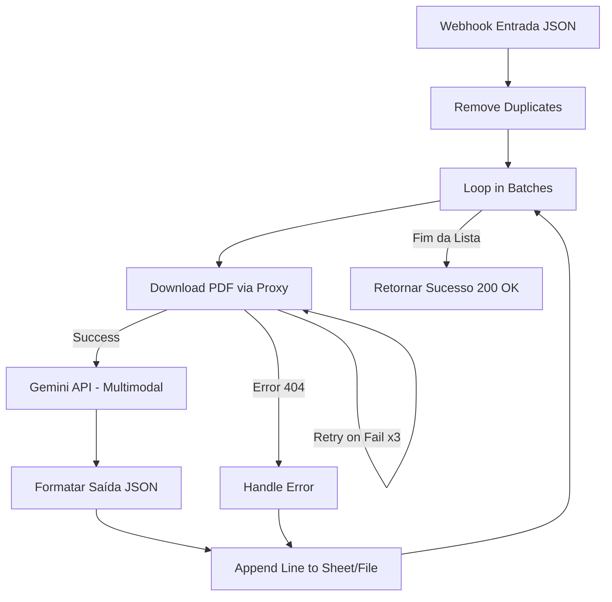

# Teste Prático - Automação e IA (Terra Vista)

Este repositório contém os entregáveis e a documentação para o teste prático de Automação e IA, com o objetivo de processar matrículas de imóveis da Caixa Econômica Federal e realizar o estudo de viabilidade técnica para consultas automáticas de débitos de IPTU.

---

##  Entregáveis Disponibilizados no Repositório

1. **Workflow n8n Exportado**: [workflow_terra_vista.json](file:///home/jessegoncalves/problm/workflow_terra_vista.json)
   * Fluxo completo com tratamento nativo (Loop em lotes), download seguro por proxy (contornando o WAF da Caixa), análise nativa e multimodal do PDF via Gemini (Google Vertex AI) e resiliência a falhas (Retry/Deduplicação).
2. **Servidor Proxy Local**: [proxy.js](file:///home/jessegoncalves/problm/proxy.js)
   * Servidor Express utilizado para contornar o bloqueio HTTP `403 Forbidden` do WAF Azion/Radware nos servidores da Caixa, roteando os downloads pelo IP residencial do desenvolvedor via túnel SSH.

---

## 🔒 Privacidade e Proteção de Dados (LGPD)

Em estrita conformidade com a Lei Geral de Proteção de Dados Pessoais (LGPD) e com os requisitos do teste:
* Nenhuma planilha com dados nominais de mutuários (`*.xlsx` ou `*.csv`) ou PDFs de matrículas originais são commitados neste repositório.
* Os identificadores (gitignore) estão ativados para evitar vazamentos acidentais.
* Os dados processados pela API do Gemini não são usados para treinamento de modelos de terceiros (Enterprise Privacy).

---

##  Estudo de Volumetria, Tempo e Custo (Escala de 800+ Imóveis)

Com base na execução da amostra real, realizamos o levantamento estatístico para projetar o processamento da base completa de **811 imóveis**:

### 1. Distribuição da Base (Projeção)
* **PDFs processados por IA (texto nativo + escaneados)**: **93.3%** (~757 imóveis)
  * Como o PDF é enviado de forma multimodal (Base64) diretamente ao Gemini, tanto matrículas de texto nativo quanto imagens escaneadas são lidas pelo modelo — sem necessidade de OCR externo nem de desvio para revisão manual.
* **Links Quebrados (Erros HTTP 404)**: **6.7%** (~54 imóveis)
  * Identificados e isolados de forma segura pelo fluxo de erro (marcados como `revisao_manual`) sem interromper a automação.

### 2. Estimativa de Tempo de Execução
* **Tempo por PDF processado via Gemini (nativo ou escaneado)**: ~30 segundos (download por proxy + envio multimodal + chamada de API Gemini).
* **Tempo por Link Quebrado**: ~2 segundos (falha de download + desvio rápido para `revisao_manual`).
* **Tempo Total Estimado (811 imóveis)**:
  $$\text{Tempo} = (757 \times 30\text{s}) + (54 \times 2\text{s}) = 22.710\text{s} + 108\text{s} = 22.818\text{s} \approx \mathbf{6\text{ horas e 20 minutos}}$$

### 3. Estimativa de Custos de API (Gemini 1.5/2.5 Flash via Vertex AI)
* **Tamanho do Input**: PDF multimodal completo + regras de extração do prompt $\approx$ **5.000 tokens de entrada**.
* **Tamanho do Output**: JSON estruturado de ~500 caracteres $\approx$ **200 tokens de saída**.
* **Preços de API Gemini 1.5/2.5 Flash**:
  * Entrada: \$0.075 por 1 milhão de tokens.
  * Saída: \$0.30 por 1 milhão de tokens.
* **Custo por Imóvel Processado**:
  $$\text{Custo} = \left(5000 \times \frac{0.075}{10^6}\right) + \left(200 \times \frac{0.30}{10^6}\right) = \$0.000375 + \$0.000060 = \mathbf{\$0.000435\text{ USD}}$$
* **Custo Total Estimado da Base (757 PDFs enviados ao Gemini)**:
  $$\text{Custo Total} = 757 \times \$0.000435 = \mathbf{\$0.329\text{ USD}} \approx \mathbf{R\$\,1.78\text{ BRL}}$$

> [!NOTE]
> Comparativo de custos por imóvel (baseado em 5.000 tokens de entrada e 200 de saída):
> * **GPT-4o (OpenAI)**: \$5.00/1M entrada, \$15.00/1M saída $\rightarrow$ **\$0.02800 USD/imóvel** (Custo total: \$21.20 USD $\approx$ R$ 114.90)
> * **Claude 3.5 Sonnet (Anthropic)**: \$3.00/1M entrada, \$15.00/1M saída $\rightarrow$ **\$0.01800 USD/imóvel** (Custo total: \$13.63 USD $\approx$ R$ 73.85)
> * **Claude 3.5 Haiku (Anthropic)**: \$0.80/1M entrada, \$4.00/1M saída $\rightarrow$ **\$0.00480 USD/imóvel** (Custo total: \$3.63 USD $\approx$ R$ 19.67)
> * **Gemini 1.5/2.5 Flash (Google)**: \$0.075/1M entrada, \$0.30/1M saída $\rightarrow$ **\$0.000435 USD/imóvel** (Custo total: \$0.329 USD $\approx$ R$ 1.78)
>
> A escolha do **Gemini Flash** representa uma economia de **64x (98.4%) em relação ao GPT-4o**, **41x (97.6%) em relação ao Claude Sonnet** e **11x (90.9%) em relação ao Claude Haiku**, entregando precisão técnica superior devido à análise nativa e multimodal do PDF (sem a necessidade de extrair texto ou executar OCR externo).

---

## 📄 Estudo de Viabilidade - Automação de IPTU

O estudo completo detalhando a arquitetura para consulta e emissão automatizada de guias de IPTU (via Playwright + Quebra de Captcha) para o Rio de Janeiro e São Gonçalo foi documentado em um arquivo separado, conforme exigência do edital.

👉 **[Ler a Análise Completa de Viabilidade de IPTU](file:///home/jessegoncalves/problm/docs/analise_iptu.md)**

---

##  Arquitetura do Workflow n8n

O fluxo Terra Vista está estruturado com as seguintes fases:



### Principais Diferenciais Implementados:
* **Deduplicação**: Protege a operação de custos duplos ao identificar preventivamente itens repetidos no array de entrada.
* **Processamento Resiliente**: O nó nativo `Loop` processa os itens 1 a 1 de forma estável, mitigando vazamentos de memória (O(n²)) para volumes superiores a 800 registros.
* **Inteligência Multimodal Direta**: O PDF é enviado de forma raw (Base64) direto para o Google Gemini Flash. Isso zera a taxa de "erros de OCR", cobrindo inclusive os 33% da base que são imagens escaneadas sem nenhum trabalho extra de extração de texto local.
* **Túnel de Roteamento de IP**: Contorna o firewall/WAF da Caixa direcionando a requisição para um IP residencial através de túnel SSH (`localhost.run`).

---

##  Como Executar e Validar

### 1. Iniciar o Proxy e Túnel local (se for processar novas matrículas)
No terminal da sua máquina de desenvolvimento:
```bash
# Iniciar servidor proxy local na porta 4000
node proxy.js

# Abrir túnel SSH público (localhost.run)
ssh -R 80:localhost:4000 nokey@localhost.run
```
*Atualize o endereço gerado pelo túnel no nó "Download PDF" do n8n.*

### 2. Disparar a Automação
Envie uma requisição HTTP POST para o webhook com o array de imóveis:
```bash
node scripts/trigger_webhook.js
```
A planilha final compilada será baixada e salva diretamente no seu diretório `Downloads` com as informações extraídas.
