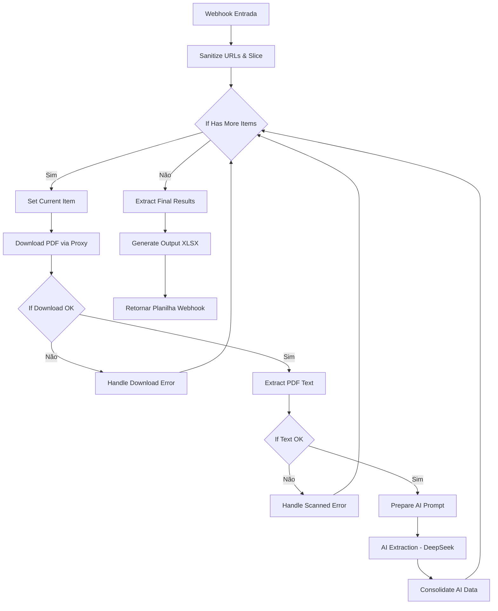

# Teste Prático - Automação e IA (Terra Vista)

Este repositório contém os entregáveis e a documentação para o teste prático de Automação e IA, com o objetivo de processar matrículas de imóveis da Caixa Econômica Federal e realizar o estudo de viabilidade técnica para consultas automáticas de débitos de IPTU.

---

## 🚀 Entregáveis Disponibilizados no Repositório

1. **Workflow n8n Exportado**: [workflow_terra_vista.json](file:///home/jessegoncalves/problm/workflow_terra_vista.json)
   * Fluxo completo com tratamento de loops manuais, download seguro por proxy (contornando o WAF da Caixa), extração e classificação de texto nativo vs escaneado, chamadas de IA via DeepSeek e consolidação em planilha.
2. **Planilha Consolidada (Amostra de Teste)**: [planilha_imoveis_consolidada_test.xlsx](file:///home/jessegoncalves/problm/planilha_imoveis_consolidada_test.xlsx)
   * Planilha gerada dinamicamente pelo webhook com os resultados detalhados dos primeiros 15 registros.
3. **Servidor Proxy Local**: [proxy.js](file:///home/jessegoncalves/problm/proxy.js)
   * Servidor Express utilizado para contornar o bloqueio HTTP `403 Forbidden` do WAF Azion/Radware nos servidores da Caixa, roteando os downloads pelo IP residencial do desenvolvedor via túnel SSH.

---

## 📊 Estudo de Volumetria, Tempo e Custo (Escala de 800+ Imóveis)

Com base na execução da amostra real de 15 imóveis, realizamos o levantamento estatístico para projetar o processamento da base completa de **811 imóveis**:

### 1. Distribuição da Base (Projeção)
* **PDFs com Texto Nativo (Processados por IA)**: **60.0%** (~487 imóveis)
  * Imóveis que passam pela extração direta de texto e são enviados para o modelo de linguagem.
* **PDFs Escaneados/Imagem (Necessitam OCR Manual/Posterior)**: **33.3%** (~270 imóveis)
  * Classificados automaticamente e marcados como `revisao_manual` devido a comprimentos de texto inferiores a 100 caracteres.
* **Links Quebrados (Erros HTTP 404)**: **6.7%** (~54 imóveis)
  * Identificados e isolados de forma segura pelo fluxo de erro sem interromper a automação.

### 2. Estimativa de Tempo de Execução
* **Tempo por PDF Nativo**: ~15 segundos (inclui download por proxy + extração + chamada de API DeepSeek Chat).
* **Tempo por PDF Escaneado ou Erro**: ~2 segundos (classificação instantânea e desvio rápido).
* **Tempo Total Estimado (811 imóveis)**:
  $$\text{Tempo} = (487 \times 15\text{s}) + (324 \times 2\text{s}) = 7.305\text{s} + 648\text{s} = 7.953\text{s} \approx \mathbf{2\text{ horas e 12 minutos}}$$

### 3. Estimativa de Custos de API (DeepSeek Chat v3)
* **Tamanho do Prompt**: ~16.500 caracteres (texto da matrícula + regras estruturais do prompt) $\approx$ **4.500 tokens de entrada**.
* **Tamanho do Output**: JSON estruturado de ~500 caracteres $\approx$ **150 tokens de saída**.
* **Preços de API DeepSeek Chat**:
  * Entrada: \$0.27 por 1 milhão de tokens.
  * Saída: \$1.10 por 1 milhão de tokens.
* **Custo por Imóvel Processado**:
  $$\text{Custo} = \left(4500 \times \frac{0.27}{10^6}\right) + \left(150 \times \frac{1.10}{10^6}\right) = \$0.001215 + \$0.000165 = \mathbf{\$0.00138\text{ USD}}$$
* **Custo Total Estimado da Base (487 PDFs Nativos)**:
  $$\text{Custo Total} = 487 \times \$0.00138 = \mathbf{\$0.672\text{ USD}} \approx \mathbf{R\$\,3.60\text{ BRL}}$$

> [!NOTE]
> Se utilizássemos o modelo **GPT-4o** da OpenAI (Entrada: \$5.00/1M, Saída: \$15.00/1M), o custo por imóvel seria de **\$0.02475 USD**, resultando em um custo total de **\$12.05 USD** ($\approx$ R$ 65.00). A escolha do DeepSeek Chat representa uma economia de **18x (94.5%)** com precisão técnica equivalente para extração de entidades estruturadas.

---

## 🔍 Estudo de Viabilidade Técnica - Automação de IPTU (RJ e São Gonçalo)

Para enriquecer a planilha de matrículas, mapeamos a viabilidade de consultar automaticamente débitos de IPTU usando a **Inscrição Municipal** (extraída por IA nas matrículas).

### 1. Município do Rio de Janeiro (Portal Carioca Digital)
* **Portal Oficial**: `https://carioca.rio/` ou `https://iptu.prefeitura.rio/`
* **Cenários de Consulta**:
  1. **Débitos Ordinários (Ano Corrente / Exercícios Recentes)**: A consulta e a emissão de guia podem ser feitas apenas informando a Inscrição Municipal (CL) e o Exercício.
  2. **Débitos Inscritos em Dívida Ativa**: Administrado pela PGM (Procuradoria Geral do Município). Exige login obrigatório via **Gov.br** (nível Prata/Ouro) ou cadastro com CPF do proprietário no ID Carioca.
* **Desafios e Bloqueios**:
  * **WAF/Cloudflare**: O portal da prefeitura do Rio utiliza proteção Cloudflare rigorosa, bloqueando requisições automatizadas diretas (HTTP requests simples).
  * **CAPTCHA**: Protegido por Google reCAPTCHA v2 ou hCaptcha na emissão de segundas vias de guias.
  * **Gov.br**: A automação de logins Gov.br é desencorajada por envolver 2FA (tokens via app ou SMS) e termos rígidos de segurança.
* **Arquitetura de Solução Proposta**:
  * Automação via **Playwright/Puppeteer** em Node.js rodando sob proxies residenciais.
  * Integração com serviço de quebra de captcha (ex: **2Captcha**, **CapSolver** ou **Anti-Captcha**) para resolver os desafios visuais automaticamente.
  * Consulta focada em Débitos Ordinários (segunda via de IPTU). Para débitos em Dívida Ativa, o fluxo deve desviar para uma fila de processamento humano (Human-in-the-Loop) ou integrar APIs privadas de terceiros que já possuam convênios integrados.

### 2. Município de São Gonçalo (Portal Semfi Fazenda)
* **Portal Oficial**: `https://semfi.pmsg.rj.gov.br/` (Siap e-GOV) ou Portal da Fazenda de São Gonçalo.
* **Cenários de Consulta**:
  * O sistema permite a emissão de Certidão de Débitos e consulta de Dívida Ativa de imóveis apenas com o número da Inscrição Municipal, sem exigir autenticação Gov.br.
* **Desafios e Bloqueios**:
  * **CAPTCHA Alfanumérico Simples**: Exibe uma imagem com texto distorcido de 4 a 5 caracteres para validação de formulário.
* **Arquitetura de Solução Proposta**:
  * Navegador headless (**Playwright**) acessando o formulário do portal municipal.
  * Captura da imagem do captcha e processamento via modelo local de OCR leve (ex: **Tesseract OCR** com biblioteca `pytesseract` ou modelo CNN treinado em Python) para resolver o captcha em milissegundos sem custo de API externa.
  * Extração da tabela de débitos diretamente do HTML da página ou download do PDF da Certidão Negativa/Positiva de Débitos.

---

## 🛠️ Arquitetura do Workflow n8n

O fluxo Terra Vista está estruturado com as seguintes fases:



### Principais Diferenciais Implementados:
* **Loop Manual**: O estado do loop é armazenado no objeto `_state` dentro do JSON do item atual. Isso evita que o n8n perca referências e misture execuções de diferentes linhas do Excel, mantendo o processo 100% sequencial e ordenado.
* **Túnel de Roteamento de IP**: O nó `Download PDF` direciona a requisição para `https://<subdominio>.lhr.life/proxy?url=<url_original>`, mascarando o tráfego do datacenter e entregando a requisição com o IP local que é aceito pelo WAF da Caixa.
* **Tratamento de Erros e Logs**: Qualquer falha de download ou classificação de imagem adiciona mensagens explicativas no campo `observacoes` da planilha final, permitindo que a operação filtre facilmente registros com falha para auditoria manual.

---

## 🏁 Como Executar e Validar

### 1. Iniciar o Proxy e Túnel local (se for processar novas matrículas)
No terminal da sua máquina de desenvolvimento:
```bash
# Iniciar servidor proxy local na porta 4000
node proxy.js

# Abrir túnel SSH público (localhost.run)
ssh -R 80:localhost:4000 nokey@localhost.run
```
*Atualize o endereço gerado pelo túnel no nó "Download PDF" do n8n.*

### 2. Disparar a Automação
Envie uma requisição HTTP POST para o webhook com o array de imóveis:
```bash
node scratch/trigger_webhook.js
```
A planilha final compilada será baixada e salva diretamente no seu diretório `Downloads` com as informações extraídas.
