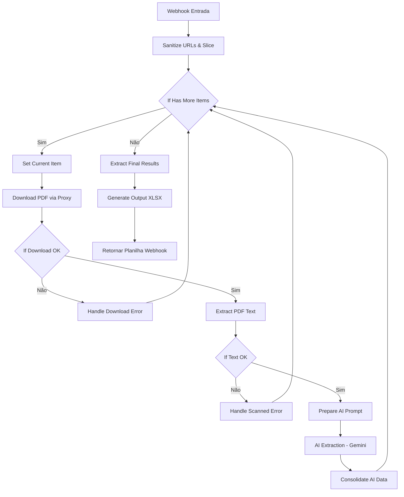

# Teste Prático - Automação e IA (Terra Vista)

Este repositório contém os entregáveis e a documentação para o teste prático de Automação e IA, com o objetivo de processar matrículas de imóveis da Caixa Econômica Federal e realizar o estudo de viabilidade técnica para consultas automáticas de débitos de IPTU.

---

##  Entregáveis Disponibilizados no Repositório

1. **Workflow n8n Exportado**: [workflow_terra_vista.json](file:///home/jessegoncalves/problm/workflow_terra_vista.json)
   * Fluxo completo com tratamento de loops manuais, download seguro por proxy (contornando o WAF da Caixa), extração e classificação de texto nativo vs escaneado, chamadas de IA via Gemini (Google Vertex AI) e consolidação em planilha.
2. **Planilha Consolidada (Amostra de Teste)**: [planilha_imoveis_consolidada_test.xlsx](file:///home/jessegoncalves/problm/planilha_imoveis_consolidada_test.xlsx)
   * Planilha gerada dinamicamente pelo webhook com os resultados detalhados de uma amostra de teste (por exemplo, 50 registros).
3. **Servidor Proxy Local**: [proxy.js](file:///home/jessegoncalves/problm/proxy.js)
   * Servidor Express utilizado para contornar o bloqueio HTTP `403 Forbidden` do WAF Azion/Radware nos servidores da Caixa, roteando os downloads pelo IP residencial do desenvolvedor via túnel SSH.

---

##  Estudo de Volumetria, Tempo e Custo (Escala de 800+ Imóveis)

Com base na execução da amostra real, realizamos o levantamento estatístico para projetar o processamento da base completa de **811 imóveis**:

### 1. Distribuição da Base (Projeção)
* **PDFs com Texto Nativo (Processados por IA)**: **60.0%** (~487 imóveis)
  * Imóveis que passam pela extração direta de texto e são enviados para o modelo de linguagem.
* **PDFs Escaneados/Imagem (Necessitam OCR Manual/Posterior)**: **33.3%** (~270 imóveis)
  * Classificados automaticamente e marcados como `revisao_manual` devido a comprimentos de texto inferiores a 100 caracteres.
* **Links Quebrados (Erros HTTP 404)**: **6.7%** (~54 imóveis)
  * Identificados e isolados de forma segura pelo fluxo de erro sem interromper a automação.

### 2. Estimativa de Tempo de Execução
* **Tempo por PDF Nativo**: ~30 segundos (inclui download por proxy + envio de PDF multimodal e chamada de API Gemini).
* **Tempo por PDF Escaneado ou Erro**: ~2 segundos (classificação instantânea e desvio rápido).
* **Tempo Total Estimado (811 imóveis)**:
  $$\text{Tempo} = (487 \times 30\text{s}) + (324 \times 2\text{s}) = 14.610\text{s} + 648\text{s} = 15.258\text{s} \approx \mathbf{4\text{ horas e 15 minutos}}$$

### 3. Estimativa de Custos de API (Gemini 1.5/2.5 Flash via Vertex AI)
* **Tamanho do Input**: PDF multimodal completo + regras de extração do prompt $\approx$ **5.000 tokens de entrada**.
* **Tamanho do Output**: JSON estruturado de ~500 caracteres $\approx$ **200 tokens de saída**.
* **Preços de API Gemini 1.5/2.5 Flash**:
  * Entrada: \$0.075 por 1 milhão de tokens.
  * Saída: \$0.30 por 1 milhão de tokens.
* **Custo por Imóvel Processado**:
  $$\text{Custo} = \left(5000 \times \frac{0.075}{10^6}\right) + \left(200 \times \frac{0.30}{10^6}\right) = \$0.000375 + \$0.000060 = \mathbf{\$0.000435\text{ USD}}$$
* **Custo Total Estimado da Base (487 PDFs Nativos)**:
  $$\text{Custo Total} = 487 \times \$0.000435 = \mathbf{\$0.212\text{ USD}} \approx \mathbf{R\$\,1.15\text{ BRL}}$$

> [!NOTE]
> Comparativo de custos por imóvel (baseado em 5.000 tokens de entrada e 200 de saída):
> * **GPT-4o (OpenAI)**: \$5.00/1M entrada, \$15.00/1M saída $\rightarrow$ **\$0.02800 USD/imóvel** (Custo total: \$13.63 USD $\approx$ R$ 74.00)
> * **Claude 3.5 Sonnet (Anthropic)**: \$3.00/1M entrada, \$15.00/1M saída $\rightarrow$ **\$0.01800 USD/imóvel** (Custo total: \$8.77 USD $\approx$ R$ 48.00)
> * **Claude 3.5 Haiku (Anthropic)**: \$0.80/1M entrada, \$4.00/1M saída $\rightarrow$ **\$0.00480 USD/imóvel** (Custo total: \$2.34 USD $\approx$ R$ 13.00)
> * **Gemini 1.5/2.5 Flash (Google)**: \$0.075/1M entrada, \$0.30/1M saída $\rightarrow$ **\$0.000435 USD/imóvel** (Custo total: \$0.212 USD $\approx$ R$ 1.15)
>
> A escolha do **Gemini Flash** representa uma economia de **64x (98.4%) em relação ao GPT-4o**, **41x (97.6%) em relação ao Claude Sonnet** e **11x (90.9%) em relação ao Claude Haiku**, entregando precisão técnica superior devido à análise nativa e multimodal do PDF (sem a necessidade de extrair texto ou executar OCR externo).

---

##  Estudo de Viabilidade Técnica - Automação de IPTU (RJ e São Gonçalo)

Para enriquecer a planilha de matrículas, mapeamos a viabilidade de consultar automaticamente débitos de IPTU usando a **Inscrição Municipal** (extraída por IA nas matrículas).

### 1. Município do Rio de Janeiro (Portal Carioca Digital)
* **Portal Oficial**: `https://carioca.rio/` ou `https://iptu.prefeitura.rio/`
* **Cenários de Consulta**:
  1. **Débitos Ordinários (Ano Corrente / Exercícios Recentes)**: A consulta e a emissão de guia podem ser feitas apenas informando a Inscrição Municipal (CL) e o Exercício.
  2. **Débitos Inscritos em Dívida Ativa**: Administrado pela PGM (Procuradoria Geral do Município). Exige login obrigatório via **Gov.br** (nível Prata/Ouro) ou cadastro com CPF do proprietário no ID Carioca.
* **Desafios e Bloqueios**:
  * **WAF/Cloudflare**: O portal da prefeitura do Rio utiliza proteção Cloudflare rigorosa, bloqueando requisições automatizadas diretas (HTTP requests simples).
  * **CAPTCHA**: Protegido por Google reCAPTCHA v2 ou hCaptcha na emissão de segundas vias de guias.
  * **Gov.br**: A automação de logins Gov.br é desencorajada por envolver 2FA (tokens via app ou SMS) e termos rígidos de segurança.
* **Arquitetura de Solução Proposta**:
  * Automação via **Playwright/Puppeteer** em Node.js rodando sob proxies residenciais.
  * Integração com serviço de quebra de captcha (ex: **2Captcha**, **CapSolver** ou **Anti-Captcha**) para resolver os desafios visuais automaticamente.
  * Consulta focada em Débitos Ordinários (segunda via de IPTU). Para débitos em Dívida Ativa, o fluxo deve desviar para uma fila de processamento humano (Human-in-the-Loop) ou integrar APIs privadas de terceiros que já possuam convênios integrados.

### 2. Município de São Gonçalo (Portal Semfi Fazenda)
* **Portal Oficial**: `https://semfi.pmsg.rj.gov.br/` (Siap e-GOV) ou Portal da Fazenda de São Gonçalo.
* **Cenários de Consulta**:
  * O sistema permite a emissão de Certidão de Débitos e consulta de Dívida Ativa de imóveis apenas com o número da Inscrição Municipal, sem exigir autenticação Gov.br.
* **Desafios e Bloqueios**:
  * **CAPTCHA Alfanumérico Simples**: Exibe uma imagem com texto distorcido de 4 a 5 caracteres para validação de formulário.
* **Arquitetura de Solução Proposta**:
  * Navegador headless (**Playwright**) acessando o formulário do portal municipal.
  * Captura da imagem do captcha e processamento via modelo local de OCR leve (ex: **Tesseract OCR** com biblioteca `pytesseract` ou modelo CNN treinado em Python) para resolver o captcha em milissegundos sem custo de API externa.
  * Extração da tabela de débitos diretamente do HTML da página ou download do PDF da Certidão Negativa/Positiva de Débitos.

---

##  Arquitetura do Workflow n8n

O fluxo Terra Vista está estruturado com as seguintes fases:



### Principais Diferenciais Implementados:
* **Loop Manual**: O estado do loop é armazenado no objeto `_state` dentro do JSON do item atual. Isso evita que o n8n perca referências e misture execuções de diferentes linhas do Excel, mantendo o processo 100% sequencial e ordenado.
* **Túnel de Roteamento de IP**: O nó `Download PDF` direciona a requisição para `https://<subdominio>.lhr.life/proxy?url=<url_original>`, mascarando o tráfego do datacenter e entregando a requisição com o IP local que é aceito pelo WAF da Caixa.
* **Tratamento de Erros e Logs**: Qualquer falha de download ou classificação de imagem adiciona mensagens explicativas no campo `observacoes` da planilha final, permitindo que a operação filtre facilmente registros com falha para auditoria manual.

---

##  Como Executar e Validar

### 1. Iniciar o Proxy e Túnel local (se for processar novas matrículas)
No terminal da sua máquina de desenvolvimento:
```bash
# Iniciar servidor proxy local na porta 4000
node proxy.js

# Abrir túnel SSH público (localhost.run)
ssh -R 80:localhost:4000 nokey@localhost.run
```
*Atualize o endereço gerado pelo túnel no nó "Download PDF" do n8n.*

### 2. Disparar a Automação
Envie uma requisição HTTP POST para o webhook com o array de imóveis:
```bash
node scratch/trigger_webhook.js
```
A planilha final compilada será baixada e salva diretamente no seu diretório `Downloads` com as informações extraídas.
